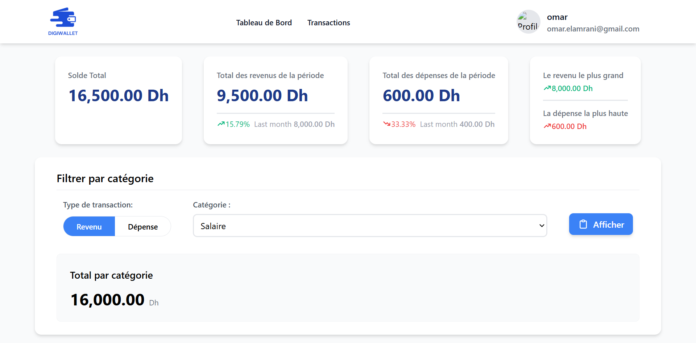
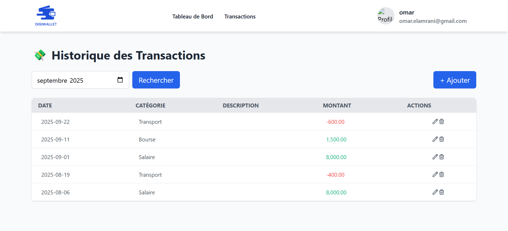

# DigiWallet


## Description
Une application web développée en PHP permettant à un utilisateur de gérer facilement ses revenus et dépenses, de suivre l’évolution de son solde, et de visualiser un historique et un résumé budgétaire.

## Fonctionnalités principales

- Authentification et inscription avec mot de passe haché pour une sécurité renforcée.

- Gestion des transactions (ajout, modification, suppression)

- L’historique des transactions triées par date.

- Filtrer par année et par mois pour un suivi précis.

- Tableau de bord :

    Solde actuel de l’utilisateur.

    Résumé du mois en cours : total des revenus et dépenses.

    Répartition par catégorie (revenus/dépenses).

    Identification de la plus grande dépense et du plus grand revenu du mois.

## Structure du projet

```bash
gestion-budget
├── assets                  # Description de projet, base de données et les catégories
├── images                  # Images utilisées dans le projet
├── controllers
│   ├── user.php            # Fonctions liées à l'utilisateur (inscription, login, profil)
│   ├── transactions.php    # Fonctions liées aux transactions
│   └── dashboard.php       # Fonctions liées au tableau de bord
├── views
│   ├── login.php           # Page de connexion
│   ├── register.php        # Page d'inscription
│   ├── dashboard.php       # Tableau de bord
│   └── transactions.php    # Gestion des transactions
├── bd.sql                  # Script de création de la base de données
├── index.php               # Page d'accueil
├── config.php              # Configuration de la connexion à la base de données
├── header.php              # Header commun à toutes les pages
└── README.md               # Documentation du projet

```

## Sécurité

Mots de passe hachés avec password_hash() et vérifiés avec password_verify().

Données nettoyées et validées avant insertion (prévention des injections SQL et XSS).

## Installation

1. Cloner le projet :

```bash
git clone https://github.com/Fatima-Zohra-Jaber/gestion-budget

```

2. Importer la base de données avec `db.sql`.

3. Configurer la connexion MySQL dans `config.php`.

4. Lancer le projet avec un serveur local (XAMPP, Laragon, WAMP).

5. Accéder à l’application via un navigateur `http://localhost/gestion-budget/index.php`

## Aperçu (exemples d’écrans)

### Tableau de bord avec résumé mensuel



### Historique des transactions filtrable

